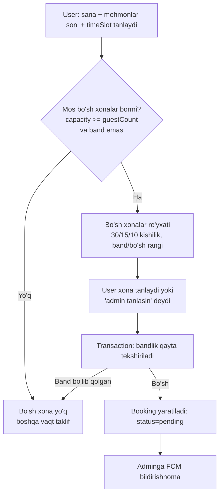
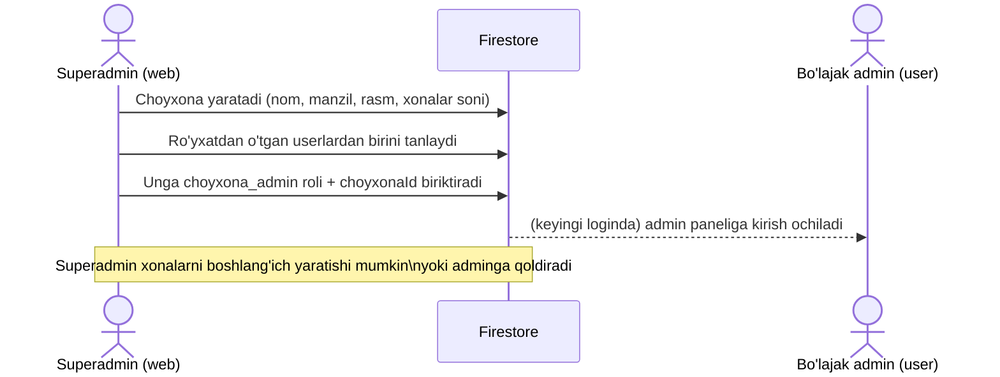
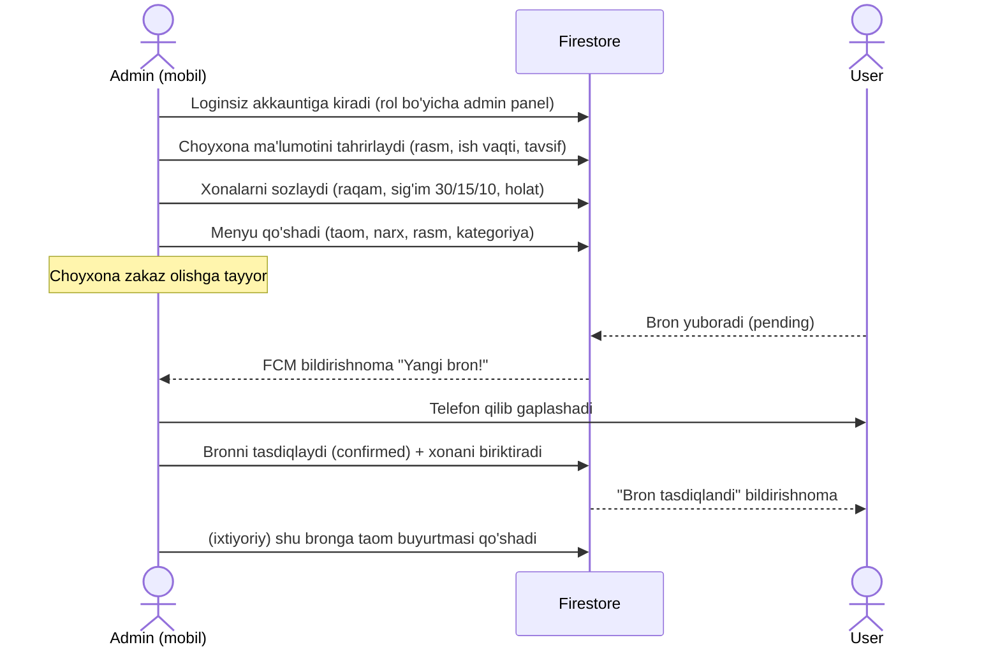
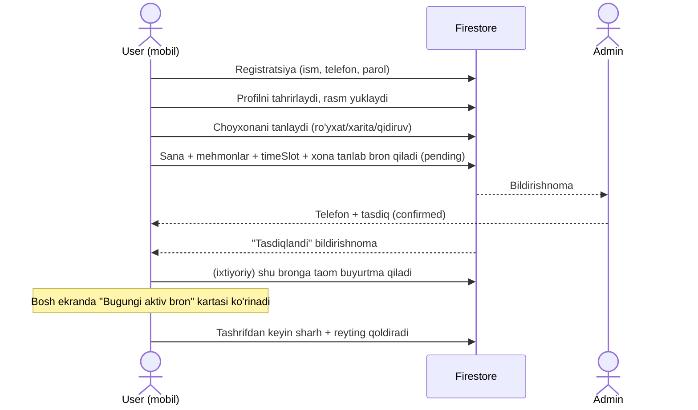
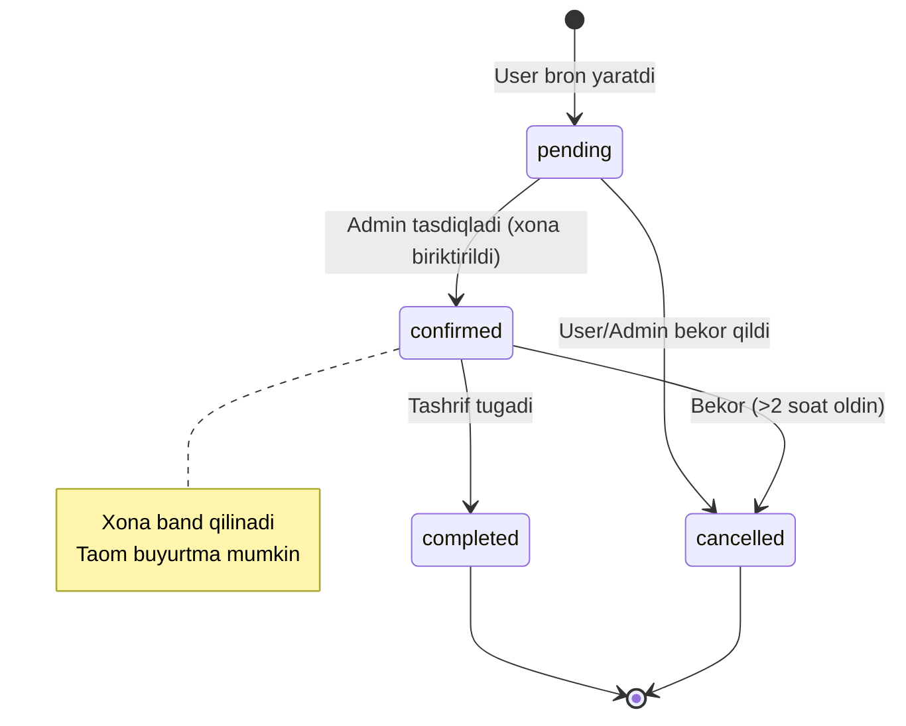

# Texnik Topshiriq (TZ v2) — Choyxona.uz

> **Status:** Tasdiqlash kutilmoqda. Tasdiqlangach ishga kirishiladi.
> **Sana:** 2026-06-20 · **Branch:** `claude/jolly-gauss-icfon0`
>
> Ushbu TZ ikki qismdan iborat:
> **A) HOZIRGI HOLAT (As-Is)** — loyiha ayni paytda qanday;
> **B) KELAJAK HOLAT (To-Be)** — nima o'zgaradi, qo'shiladi, redizayn qilinadi.

---

## 0. Asosiy talablar (mijoz so'zidan)

1. **Superadmin** — web/desktop'dan foydalanadi. **Admin** va **user** — mobil (≈60% iOS, qolgani Android).
2. **Sig'im = xonalar soni.** Bitta choyxonada 20 xona bo'lsa, bir vaqtda faqat 20 ta bron qabul qilinadi.
3. **Stollar emas — xonalar (xona).** Har xona: bandligi (band/bo'sh) va sig'imi (masalan 30, 15, 10 kishilik) ko'rinadi. Interfeys chiroyli va aniq.
4. **Frontend 0 dan redizayn** — butunlay yangi, zamonaviy, chiroyli; barcha oynalar yangicha.
5. **Admin paneldagi barcha oynalar 100% ishlaydigan va mukammal.**
6. **Barcha ekranlar (admin + user) 100% 3 tilda** (uz / ru / en) lokalizatsiya qilinadi.
7. Bugungi **aktiv bron** user oynasida ko'rinib turishi shart.

---

# QISM A — HOZIRGI HOLAT (As-Is)

## A.1 Texnologiyalar

| Qatlam | Hozir |
|---|---|
| Frontend | Flutter (Dart 3.10), Provider |
| Backend | Firebase: Auth, Firestore, Storage, FCM, Cloud Functions (TS) |
| Lokalizatsiya | `easy_localization` (uz/ru/en), fallback **ru** |
| Holat | ~39 000 qator Dart, ~95 fayl |
| Build target | Android, iOS, Web (vercel.json mavjud) |

## A.2 Ma'lumotlar modellari (Firestore kolleksiyalari)

| Kolleksiya | Asosiy maydonlar | Izoh |
|---|---|---|
| `users` | role, choyxonaId, firstName/lastName, phone, photoUrl, isActive, deviceTokens, favoriteChoyxonas, totalBookings | role: `client`/`choyxona_admin`/`choyxona_owner`/`superadmin` |
| `choyxonas` | name(+Uz/Ru/En), address, contacts, workingHours, images, **capacity**, **roomCount**, rating, ownerId, adminIds, status | Xona soni allaqachon bor |
| `rooms` | **capacity**, status (free/occupied/reserved/unavailable), number, name, amenities, photos, currentBookingId | ✅ Xona modeli **allaqachon mavjud** |
| `tables` | capacity, status, positionX/Y, shape | ⚠️ Stol modeli (eskiradi — xonaga o'tamiz) |
| `bookings` | userId, choyxonaId, bookingDate, bookingTime, timeSlot, guestCount, status, roomId, roomNumber, hasOrder, paymentStatus | status: pending/confirmed/cancelled/completed |
| `orders` | bookingId, items[], status, subtotal/discount/tips/total, addedBy(client/admin) | Bronga bog'liq taom buyurtmasi |
| `reviews`, `favorites`, `promotions`, `subscriptions`, `notifications`, `menu_items`/`dishes` | — | CRM, sharh, aksiya, obuna, bildirishnoma |

> **Muhim:** `rooms` modeli **allaqachon** capacity va status bilan tayyor. "Stollar emas, xonalar" talabi infratuzilma jihatidan mavjud — faqat to'liq ishga solish va UI kerak.

## A.3 Mavjud ekranlar

**User (mijoz) — 5 tab:** Главная, Карта, Избранное, Заказы (bron tarixi), Профиль.
Qo'shimcha: choyxona detali, bron qilish, menyu/buyurtma, sharh, sevimlilar, qidiruv, sozlamalar (til/bildirishnoma/yordam), loyalty karta, bildirishnomalar.

**Admin (choyxona) — dashboard + bo'limlar** (screenshotdagi grid):
Бронирования, Меню, Xonalar, Отзывы, Tahlil & Kassa, Инфо, Акции, Отчёты + statistika (bugun/kutilayotgan/jami/reyting).
Ekranlar: menu_management, tables_management, choyxona_bookings, analytics, reviews, edit_choyxona, promotion_editor, reports, cash_register_report, active_orders, create_order, bill_calculator, order_history.

**Superadmin:** dashboard, all_choyxonas, all_users, all_bookings, assign_admin, subscriptions, platform_settings, CRM (dashboard/customer_list/customer_detail).

## A.4 Lokalizatsiya holati (real raqamlar)

| Til | Kalitlar | Holat |
|---|---|---|
| ru | 541 | eng to'liq (baza) |
| uz | 486 | **57 kalit yetishmaydi** |
| en | 476 | **65 kalit yetishmaydi** |

→ Ko'p ekranlarda matnlar tarjimasiz yoki hardcoded. 100% lokalizatsiya uchun jiddiy ish kerak.

## A.5 Aniqlangan muammolar

### 🔴 P0 — Bloker / xavfsizlik / asosiy mantiq
- **P0-1** Rol nomi nomuvofiqligi: ilova `choyxona_owner`, `firestore.rules` `'owner'` tekshiradi → `isChoyxonaOwner()` hech qachon ishlamaydi.
- **P0-2** Bron bandligi tekshirilmaydi: `createBooking()` ichida `checkAvailability()` chaqirilmaydi → dublikat/haddan ortiq bron. Xona soni limiti yo'q.
- **P0-3** Email verification yuboriladi, lekin tekshirilmaydi.
- **P0-4** `main.dart` har startda `_fixAdminChoyxonaId()` hack'ini ishlatadi (`admin@gmail.com` qidiradi).
- **P0-5** `users` create rule `role in ['client','user','owner']` → `choyxona_owner` ni rad etadi.

### 🟠 P1 — Arxitektura / barqarorlik
- **P1-1** `AuthProvider` umuman ishlatilmaydi (dead code); auth holati har joyda `AuthService()` qayta yaratiladi.
- **P1-2** `DataSyncProvider` da `bookings`/`users` listenerlari o'chirilgan → bog'liq metodlar o'lik.
- **P1-3** Rol birlashtirish kerak (admin/owner) — ~8 faylga ta'sir.
- **P1-4** Xatoliklar jim yutiladi (`return false`/`[]`).

### 🟡 P2 — Sifat
- **P2-1** Dead fayllar: `*.backup`, `order_model.dart.template`, `fix_choyxona_id.dart`, ishlatilmaydigan `OwnerDashboard`.
- **P2-2** 86 ta `print()`.
- **P2-3** 8 ta amalga oshirilmagan TODO (geopoisk, masofa, QR yuklash, share).
- **P2-4** Tarjimalar to'liq emas (A.4).
- **P2-5** `pubspec.yaml`: `description: "A new Flutter project."`.
- **P2-6** Config strategiyasi nomuvofiq (`firebase_options.dart` repoda, lekin `google-services.json` yo'q).

---

# QISM B — KELAJAK HOLAT (To-Be)

## B.1 Rol modeli (birlashtirilgan)

| Rol | Platforma | Huquqlar |
|---|---|---|
| `superadmin` | Web/Desktop | Choyxona yaratish, admin tayinlash, barcha ma'lumot, CRM, obunalar |
| `choyxona_admin` | Mobil | O'z choyxonasini to'liq boshqarish (menyu, xona, bron, analitika, kassa) |
| `client` | Mobil | Bron, buyurtma, sharh, sevimlilar |

> `choyxona_owner` **olib tashlanadi**, yagona `choyxona_admin` qoladi (mijoz "admin" deb ataydi). Mavjud `choyxona_owner` foydalanuvchilar Cloud Function/skript bilan `choyxona_admin` ga migratsiya qilinadi. `firestore.rules` ilova rollari bilan to'liq moslashtiriladi.

## B.2 Xona-asosli bron mantiqi (sig'im = xonalar)

**Tamoyil:** Har bron bitta **xonaga** bog'lanadi. Choyxonada `N` xona bo'lsa, bitta vaqt oralig'ida (date + timeSlot) maksimum `N` ta band bron bo'lishi mumkin.

**Bandlik qoidasi:** Xona `band` hisoblanadi, agar shu `roomId` uchun bir xil `bookingDate` va kesishuvchi vaqt oralig'ida `pending` yoki `confirmed` bron mavjud bo'lsa.

**Sig'im moslashuvi:** Xona faqat `room.capacity >= guestCount` bo'lsa taklif qilinadi (30/15/10 kishilik).

**Atomiklik:** `createBooking()` Firestore **transaction** ichida bandlikni qayta tekshirib yozadi (poyga holatlarini oldini olish).

## B.3 To'liq ssenariy (uchta rol)

### B.3.1 Superadmin (choyxona va admin yaratish)

**Qadamlar:** Choyxona yaratish → ma'lumot kiritish (nomi, manzili, rasmi, **xonalar soni**, ish vaqti, kategoriya) → admin tayinlash (mavjud userlardan) → choyxona `active` holatga o'tadi.

### B.3.2 Admin (choyxonani sozlash va bron qabul qilish)

### B.3.3 User (mijoz)

### B.3.4 Bron hayot sikli (state machine)

**Qo'shimcha mantiq (men qo'shgan, unutilgan joylar):**
- ⏰ **Auto-complete / auto-cancel:** tasdiqlanmagan (pending) bron vaqti o'tsa avtomatik bekor; tugagan bronlar `completed` ga (Cloud Function — scheduled).
- 🔔 **Bildirishnomalar to'liq sikli:** pending→admin, confirmed→user, cancelled→ikkisi, eslatma (1 soat oldin)→user.
- 🪑 **Xona holati real-time:** bron tasdiqlanganda xona `reserved`/`occupied`, bron tugaganda `free`.
- 📵 **No-show:** mijoz kelmasa admin "kelmadi" deb belgilaydi (statistikaga).
- 🔁 **Qayta bron / bekor qilish siyosati:** 2 soat qoidasi (allaqachon bor) UI da ko'rsatiladi.
- 🏠 **Bosh ekranda aktiv bron banneri:** bugungi `confirmed`/`pending` bron — countdown bilan.
- ⭐ **Sharh faqat `completed` brondan keyin** (haqiqiy tashrif).
- 💳 **To'lov holati** (naqd/click/payme) — bron va buyurtmada (hozir model bor, UI to'liq emas).

## B.4 Ma'lumotlar modeli o'zgarishlari

- `bookings`: `roomId` + `roomNumber` **majburiy** (tasdiqlashda), `tableId`/`tableNumber` eskiradi.
- `rooms`: asosiy bandlik manbasi; `tables` kolleksiyasi UI dan olib tashlanadi (model qoladi, ko'rsatilmaydi).
- `choyxonas.roomCount` ↔ haqiqiy `rooms` soni sinxron (admin xona qo'shganda yangilanadi).
- `bookings` ga `noShow: bool` qo'shiladi.

---

## B.5 REDESIGN — Dizayn tizimi (0 dan)

Butun frontend yangi, zamonaviy dizayn tilida qayta quriladi. Ikki kontekst:
**Mobil (admin+user)** va **Web/Desktop (superadmin)**.

### B.5.1 Dizayn tili
- **Uslub:** zamonaviy, "premium choyxona" — issiq ranglar (choy/yashil/oltin urg'u) + neytral fon, yumshoq soyalar, katta radius (16–24px), glassmorphism urg'ulari (mavjud `glassmorphic_search_bar` ruhida, lekin tartibli).
- **Light + Dark** to'liq qo'llab-quvvatlanadi (mavjud `ThemeProvider` saqlanadi).
- **Tipografiya:** `google_fonts` — bitta zamonaviy oila (masalan Inter/Manrope) + sarlavhalar uchun urg'u.
- **Komponentlar kutubxonasi:** yagona `app_components` — tugmalar, kartalar, input, chip, status badge, bo'sh holat (empty state), skeleton loader, bottom sheet, dialog. Hozirgi tarqoq widgetlar (`ultra_button`, `ethereal_components`) yangi tizimga konsolidatsiya qilinadi.

### B.5.2 Ekran bo'yicha yo'nalish (asosiy)
- **User Home:** hero qidiruv, kategoriya chiplari, "Bugungi aktiv bron" banneri, tavsiya etilgan choyxonalar (chiroyli kartalar, reyting, masofa).
- **Choyxona detali:** parallax header (bor), xonalar grid'i (sig'im + band/bo'sh rangi), menyu preview, sharhlar, pastda "Bron qilish" bar.
- **Bron oqimi:** bosqichli (sana → mehmonlar → xona tanlash → tasdiq) chiroyli stepper.
- **Xona tanlash UI:** kartalar/grid — har xonada sig'im belgisi (👥30/15/10), holat rangi (yashil=bo'sh, qizil=band, kulrang=mavjud emas), tanlanganda highlight.
- **Admin dashboard:** screenshotdagi grid yangilanadi — jonli statistika kartalar, tezkor amallar, real-time bron oqimi.
- **Admin "Xonalar":** vizual xona boshqaruvi (qo'shish/tahrirlash, sig'im, holat), real-time bandlik.
- **Superadmin (web):** keng layout, jadval/grafik, sidebar navigatsiya, CRM panellari.

### B.5.3 Adaptivlik
- Mobil: bottom navigation (user), grid dashboard (admin).
- Web/Desktop: sidebar + keng kontent (mavjud `adaptive_scaffold` rivojlantiriladi).

---

## B.6 Lokalizatsiya rejasi (3 til 100%)

- Barcha 3 fayl kalitlari **bir xil to'plamga** keltiriladi (ru baza, uz/en to'ldiriladi).
- Yangi redizayn ekranlaridagi **har bir matn** `.tr()` orqali; hardcoded matn qolmaydi.
- Audit skripti: kodda ishlatilgan `.tr()` kalitlari ↔ json kalitlari mosligini tekshirish (yetishmagan/ortiqcha kalitlar).
- Sana/raqam/pul formatlari `intl` orqali til bo'yicha.
- Asosiy/fallback til qarori: **Q1** (pastda).

---

## B.7 Ish bosqichlari + CHECKLIST

### ✅ Faza 0 — Tayyorgarlik
- [ ] Flutter SDK aniqlash/o'rnatish, `flutter pub get`
- [ ] `flutter analyze` — haqiqiy xatolar ro'yxati
- [ ] Baseline web build tekshiruvi
- [ ] Dizayn tizimi (ranglar, tipografiya, komponentlar) — `app_components` skeleti

### ✅ Faza 1 — P0 buglar (mantiq + xavfsizlik)
- [ ] Rol nomlarini moslashtirish (`firestore.rules` ↔ ilova) — P0-1, P0-5
- [ ] `_fixAdminChoyxonaId()` va `fix_choyxona_id.dart` olib tashlash — P0-4
- [ ] Xona-asosli bron + transaction + bandlik tekshiruvi — P0-2
- [ ] Email verification: yoqish yoki ongli o'chirish — P0-3

### ✅ Faza 2 — Rollarni birlashtirish
- [ ] `choyxona_owner` → `choyxona_admin` (kod, ~8 fayl)
- [ ] Firestore migration (mavjud foydalanuvchilar)
- [ ] Yagona admin dashboard (dead `OwnerDashboard` olib tashlash)

### ✅ Faza 3 — State management & barqarorlik
- [ ] `AuthProvider` ni ulash, ekranlarni o'tkazish — P1-1
- [ ] `DataSyncProvider` ni to'g'rilash (listener/dead kod) — P1-2
- [ ] Markazlashgan error handling + logger (print→logger) — P1-4, P2-2

### ✅ Faza 4 — REDESIGN (frontend 0 dan)
- [ ] Dizayn tizimi yakunlash (komponentlar, theme)
- [ ] User ekranlari: Home, Detali, Bron oqimi, Xona tanlash, Buyurtma, Profil, Sevimlilar, Qidiruv, Sozlamalar, Bildirishnoma
- [ ] "Bugungi aktiv bron" banneri
- [ ] Admin ekranlari: Dashboard, Bronlar, Menyu, **Xonalar**, Sharhlar, Tahlil&Kassa, Info, Aksiya, Hisobot
- [ ] Superadmin (web): Dashboard, Choyxonalar, Userlar, Bronlar, Admin tayinlash, CRM, Obunalar, Sozlamalar

### ✅ Faza 5 — Lokalizatsiya 100%
- [ ] 3 til kalitlarini tenglashtirish
- [ ] Hardcoded matnlarni `.tr()` ga
- [ ] Audit skripti bilan tekshirish

### ✅ Faza 6 — TODO & tozalik
- [ ] Dead fayllar o'chirish — P2-1
- [ ] TODO'lar (masofa/geopoisk/QR/share) — P2-3
- [ ] `pubspec.yaml`, app nomi, versiya — P2-5
- [ ] Config strategiyasi — P2-6

### ✅ Faza 7 — Platforma & build
- [ ] Web build + Vercel
- [ ] Android (signing, ruxsatlar)
- [ ] iOS (Info.plist ruxsatlari)

### ✅ Faza 8 — Test & qabul
- [ ] Har rol bo'yicha smoke-test (Web+Android+iOS)
- [ ] Acceptance criteria tekshiruvi

---

## B.8 Acceptance criteria ("100% ishlash")

1. **Auth:** registratsiya → login → rol bo'yicha to'g'ri panel → logout.
2. **User:** choyxona topish → xona tanlab bron (band xona rad etiladi) → bugungi aktiv bron ko'rinadi → tasdiq bildirishnomasi → taom buyurtma → bekor qilish → sharh.
3. **Admin:** dashboard → menyu CRUD → **xona CRUD (sig'im+holat)** → bron tasdiq/rad + xona biriktirish → analitika → kassa/hisobot → aksiya. **Barcha oynalar ishlaydi.**
4. **Superadmin (web):** choyxona yaratish → admin tayinlash → barcha ma'lumot → CRM → obunalar.
5. **Bildirishnomalar:** pending→admin, confirmed→user (FCM) ishlaydi.
6. **Lokalizatsiya:** 3 tilda **0 ta** bo'sh/tarjimasiz matn.
7. **Sig'im qoidasi:** xonalar soni limiti hech qachon buzilmaydi (transaction test).
8. `flutter analyze` 0 error; 3 platformada release build muvaffaqiyatli.

---

## B.9 Qo'shimcha takliflar (mening)

| # | Taklif | Foyda |
|---|---|---|
| T1 | **Telefon + SMS auth** (Firebase Phone Auth) | Mijozlar uchun emaildan qulayroq (UZ bozori) |
| T2 | **Scheduled Cloud Functions** — auto-cancel/complete, eslatma push | Qo'lda ish kamayadi |
| T3 | **Bron uchun QR/raqam** — admin tekshiradi | Kelganda tez identifikatsiya |
| T4 | **Offline-friendly** — Firestore cache + skeleton loader | Sekin internetda ham UX yaxshi |
| T5 | **Analitika eventlari** (firebase_analytics bor) | Mijoz xulqi, biznes qaror |
| T6 | **Roli o'zgarganda real-time qayta yo'naltirish** | Admin tayinlangach darhol panel |
| T7 | **Test qoplami** — kamida booking transaction uchun unit test | Sig'im mantiqi ishonchli |
| T8 | **CI** (GitHub Actions: analyze+build) | Har push'da sifat nazorati |

---

## B.10 Ochiq savollar (tasdiqlashdan oldin)

- **Q1 — Til:** asosiy/fallback til **uz** bo'lsinmi (hozir ru)?
- **Q2 — Auth turi:** email/parol qoladimi yoki **telefon+SMS** ga o'tamizmi (T1)?
- **Q3 — Xona tanlash:** user xonani **o'zi tanlaydimi**, yoki faqat so'raydi va **admin biriktiradimi**? (TZ ikkalasini ham qo'llaydi — default qaysi?)
- **Q4 — timeSlot:** bron **vaqt oralig'i** (ertalab/kechqurun) bo'yichami yoki **aniq soat** bo'yichami band qilinadi?
- **Q5 — To'lov:** ilova ichida onlayn to'lov (Click/Payme) **shu bosqichda** kerakmi yoki keyinroqmi?
- **Q6 — Redizayn yo'nalishi:** ranglar/uslub bo'yicha namuna (mood) bersangiz — moslashtiraman.

---

> **Keyingi qadam:** ushbu TZ ni ko'rib chiqing. Ochiq savollarga (B.10) javob bering va tasdiqlang — so'ng **Faza 0** dan ishga kirishaman. Eslatma: bu sessiyada repoga **push huquqi yo'q** (403) — uni ham hal qilish kerak.
</content>
